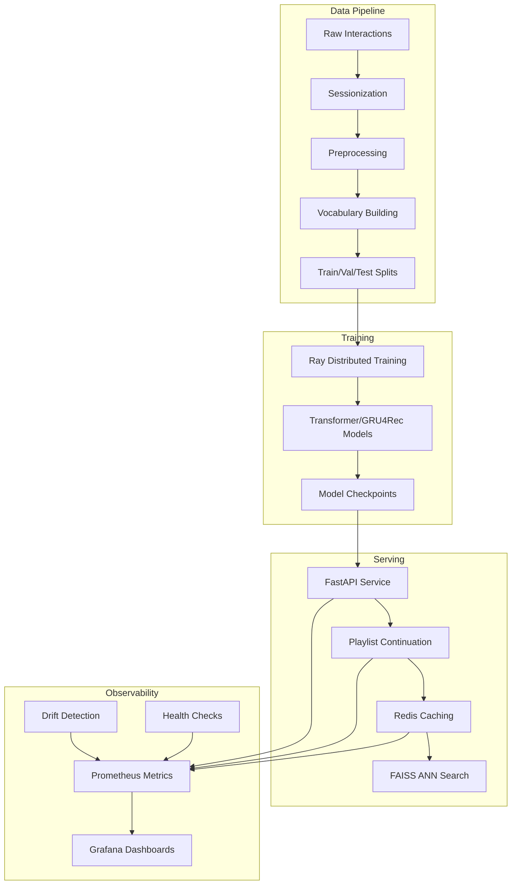

# PlayListAI

A production-quality context-aware playlist continuation system that models playlist continuation as sequence prediction using Transformer (SASRec-style) and GRU4Rec baselines.

## 🎯 Goals & Success Metrics

- **Recall@20 ≥ 0.45**: At least 45% of relevant tracks found in top-20 recommendations
- **nDCG@10 ≥ 0.30**: Normalized Discounted Cumulative Gain of 30% or higher
- **p99 < 120ms**: 99th percentile latency under 120ms for API responses
- **Coverage@100 ≥ 0.60**: At least 60% of catalog covered in top-100 recommendations
- **Repetition Rate ≤ 5%**: Less than 5% repetition in 20-song recommendation slates

## 🏗️ Architecture



## 🚀 Quickstart

### 1. Setup Environment

```bash
# Clone and setup
git clone <repository-url>
cd playlistai

# Copy environment file
cp env.example .env

# Install dependencies
make setup
```

### 2. Data Pipeline

```bash
# Generate synthetic data
make data

# Preprocess and create sequences
make preprocess

# Create train/val/test splits
make splits
```

### 3. Training

```bash
# Train model with Ray
make train

# Evaluate model
make eval

# Export for serving
make export
```

### 4. Serve API

```bash
# Start all services with Docker Compose
make up

# Or run API locally
make api
```

### 5. Test API

```bash
# Health check
curl "http://localhost:8088/healthz"

# Get playlist continuation
curl -X POST "http://localhost:8088/continue" \
  -H "Content-Type: application/json" \
  -d '{
    "tracks": ["track_123", "track_456", "track_789"],
    "k": 20,
    "context": {"hour": 21, "dow": 5}
  }'
```

## 📊 API Usage

### POST /continue

Continue a playlist with context-aware recommendations.

**Request:**

```json
{
  "tracks": ["track_123", "track_456", "track_789"],
  "k": 20,
  "context": {
    "hour": 21,
    "dow": 5
  },
  "use_ann": false
}
```

**Response:**

```json
{
  "items": [
    { "track_id": "track_abc", "score": 0.95 },
    { "track_id": "track_def", "score": 0.89 },
    { "track_id": "track_ghi", "score": 0.82 }
  ]
}
```

### GET /healthz

Health check endpoint.

**Response:**

```json
{
  "status": "ok",
  "version": "1.0.0",
  "model_loaded": true,
  "cache_connected": true
}
```

### GET /metrics

Prometheus metrics endpoint.

## 🐳 Docker & Kubernetes

### Docker Compose

```bash
# Start all services
make up

# View logs
make logs

# Stop services
make down
```

Services included:

- **API**: FastAPI service on port 8088
- **Redis**: Caching layer on port 6379
- **Prometheus**: Metrics collection on port 9090
- **Grafana**: Dashboards on port 3001

### Kubernetes

```bash
# Deploy Ray cluster
kubectl apply -f infra/k8s/raycluster.yaml

# Deploy API service
kubectl apply -f infra/k8s/api-deployment.yaml
kubectl apply -f infra/k8s/api-service.yaml

# Deploy HPA
kubectl apply -f infra/k8s/hpa.yaml
```

## 📈 Observability

### Prometheus Metrics

- `request_duration_ms`: Request latency histograms
- `model_forward_ms`: Model inference time
- `ann_ms`: Approximate nearest neighbor search time
- `cache_hit_ratio`: Cache hit rate
- `errors_total`: Error counts by route
- `drift_psi`: Population Stability Index for drift detection
- `drift_ks_p`: Kolmogorov-Smirnov test p-values

### Grafana Dashboards

Access Grafana at `http://localhost:3001` (admin/admin) to view:

- Request rate and latency percentiles
- Model performance metrics
- Cache hit ratios
- Error rates and drift detection

### Drift Monitoring

```bash
# Run drift detection
make drift

# Monitor drift metrics
curl "http://localhost:8088/metrics" | grep drift
```

## 🧪 Testing

```bash
# Run unit tests
make test

# Run linting
make lint

# Full pipeline test
make pipeline
```

## 📁 Project Structure

```
playlistai/
├── README.md
├── .gitignore
├── env.example
├── docker/
│   ├── docker-compose.yml
│   ├── api.Dockerfile
│   ├── train.Dockerfile
│   ├── prometheus/
│   └── grafana/
├── infra/
│   ├── Makefile
│   └── k8s/
├── api/
│   ├── app/
│   └── tests/
├── core/
│   ├── config.py
│   ├── utils/
│   ├── data/
│   ├── models/
│   ├── train/
│   └── monitor/
└── notebooks/
```

## 🔧 Configuration

Key environment variables in `.env`:

```bash
# Data processing
SESSION_GAP_MIN=45
MAX_SEQ_LEN=50
VOCAB_MIN_FREQ=5

# API configuration
API_PORT=8088
REDIS_URL=redis://redis:6379/0
USE_FAISS=false

# Model configuration
MODEL_NAME=transformer
MODEL_D=256
LOSS_LABEL_SMOOTH=0.1

# Performance tuning
CAND_TOPK=500
```

## 🎛️ Design Trade-offs

### Transformer vs GRU4Rec

- **Transformer**: Better for long sequences, parallelizable, higher computational cost
- **GRU4Rec**: Faster inference, better for short sequences, lower memory usage

### Full Softmax vs ANN

- **Full Softmax**: Exact ranking, higher computational cost, better for small catalogs
- **ANN (FAISS)**: Approximate ranking, faster inference, better for large catalogs

### Caching Strategy

- **Redis**: Fast access, limited memory, suitable for hot recommendations
- **TTL**: 5-minute expiration balances freshness with performance

## 📊 Dataset

This system uses Last.fm-like simulated interaction data with:

- User listening sessions
- Track metadata (artist, genre)
- Temporal context (hour, day of week)
- Session-based sequences

**Note**: The dataset is synthetic and generated for demonstration purposes. For production use, ensure proper licensing and data privacy compliance.

## 🚀 Performance

### Benchmarks (CPU-only, local)

- **Training**: ~10 minutes for 10 epochs on synthetic data
- **Inference**: p99 < 120ms for 20 recommendations
- **Memory**: ~2GB for model + embeddings
- **Throughput**: ~100 QPS on single instance

### Scaling

- **Horizontal**: Kubernetes HPA based on CPU/memory
- **Vertical**: Ray distributed training across multiple nodes
- **Caching**: Redis cluster for high availability

## 🤝 Contributing

1. Fork the repository
2. Create a feature branch
3. Make changes with tests
4. Run `make test` and `make lint`
5. Submit a pull request

## 📄 License

This project is licensed under the MIT License - see the LICENSE file for details.

## 🙏 Acknowledgments

- SASRec: Self-Attentive Sequential Recommendation
- GRU4Rec: Session-based Recommendations with Recurrent Neural Networks
- Ray: Distributed computing framework
- FastAPI: Modern web framework for APIs

